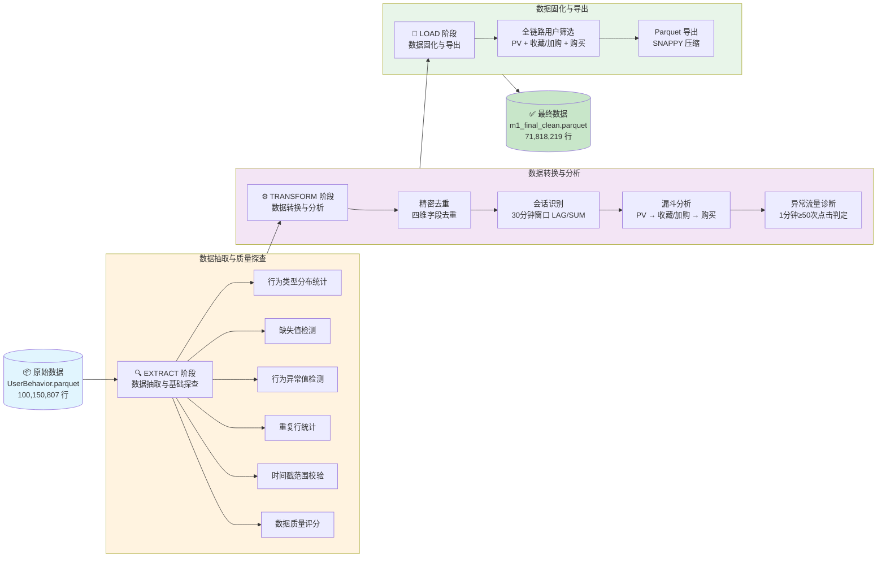

# M1 电商用户行为数据处理管道

> 基于 DuckDB 核外计算的亿级数据 ELT 管道，实现数据抽取、精密去重、会话识别、漏斗分析与异常流量诊断的全流程自动化。

---

## 📋 目录

- [项目简介](#-项目简介)
- [项目背景与实验目标](#-项目背景与实验目标)
- [数据流转图](#-数据流转图)
- [核心技术栈](#-核心技术栈)
- [项目结构](#-项目结构)
- [快速开始](#-快速开始)
- [核心业务指标](#-核心业务指标)
- [工程化特性](#-工程化特性)
- [M1 交付物清单](#-m1-交付物清单)
- [作者与致谢](#-作者与致谢)

---

## 📖 项目简介

**M1 Data Pipeline** 是大数据分析实验四的里程碑交付项目，将实验二（数据抽取与基础清洗）和实验三（精密去重、会话识别、漏斗分析、异常流量诊断、数据固化）的 Jupyter 实验代码，重构为**标准化、工程化、可复用**的 Python 数据处理管道。

项目全程采用 **DuckDB 核外计算**技术栈，彻底解决传统 Pandas 在处理亿级数据时的内存溢出（OOM）问题，实现 1 亿行数据的高效处理与质量管控。

---

## 🎯 项目背景与实验目标

### 实验背景

本实验基于阿里巴巴天池实验室公开的 `UserBehavior` 电商用户行为数据集（约 1 亿行、3.5GB CSV），模拟真实大数据场景下的数据工程处理流程。实验四 M1 里程碑要求将前期探索性实验代码重构为**工业级数据管道**，满足以下目标：

### 实验目标

| 目标 | 说明 |
|-----|------|
| **工程化重构** | 将实验 2、3 的 Notebook 代码重构为标准 Python 类 `M1DataPipeline`，提供 `extract()`、`transform()`、`load()` 三阶段接口 |
| **性能优化** | 全程使用 DuckDB 核外计算，优化 SQL 查询逻辑，减少重复数据扫描，提升执行效率 |
| **质量管控** | 实现完整的数据质量检查（缺失值、重复值、异常值、时间戳校验），生成质量评分报告 |
| **业务分析** | 实现用户会话识别（30 分钟窗口）、多级转化漏斗分析、异常流量诊断（爬虫/机器人检测） |
| **数据固化** | 筛选全链路转化用户，导出最终干净数据基座（Parquet 格式），供后续实验使用 |

---

## 🔄 数据流转图



---

## 🛠️ 核心技术栈

| 技术 | 版本 | 用途 | 说明 |
|-----|------|------|------|
| **DuckDB** | ≥1.5.0 | 核外计算引擎 | 全程唯一数据处理引擎，支持 Out-of-Core 计算 |
| **Python** | ≥3.10 | 编程语言 | 使用现代类型提示、`pathlib`、`logging` 等特性 |
| **Parquet** | - | 列式存储格式 | 输入/输出数据格式，SNAPPY 压缩 |
| **logging** | 标准库 | 日志系统 | 统一日志输出，支持调试与审计 |
| **time.perf_counter** | 标准库 | 高精度计时 | 性能基准测试（Benchmark） |

### 🚫 技术约束

- **禁止使用 Polars/Pandas**：全程 DuckDB 核外计算，避免内存溢出
- **禁止全量加载**：所有操作通过 SQL 查询流式执行
- **可重复执行**：使用 `CREATE OR REPLACE TEMP TABLE` 支持多次运行

---

## 📁 项目结构

```
week1/
├── data/                           # 数据目录
│   ├── UserBehavior.parquet        # 原始输入数据（100,150,807 行）
│   └── m1_final_clean.parquet      # M1 最终干净数据（71,818,219 行）
│
├── notebooks/                      # 原始 Jupyter 实验代码
│   ├── experiment2.ipynb           # 实验二：数据抽取 + 基础清洗
│   └── experiment3.ipynb           # 实验三：去重 + 会话 + 漏斗 + 异常诊断
│
├── reports/                        # 实验报告与文档
│   └── M1代码审计与优化报告.md     # 任务2：代码审计与优化报告
│
├── m1_pipeline.py                  # M1DataPipeline 核心管道类（1025 行）
├── run_m1_pipeline.py              # 一键运行主程序（含 Benchmark）
└── README.md                       # 本文件
```

---

## 🚀 快速开始

### 环境要求

- **操作系统**：Windows / macOS / Linux
- **Python 版本**：≥ 3.10
- **磁盘空间**：至少 5GB（输入数据 ~1GB + 输出数据 ~919MB）
- **内存要求**：≥ 4GB（DuckDB 核外计算，低内存友好）

### 安装依赖

```bash
# 安装 DuckDB（唯一第三方依赖）
pip install duckdb
```

### 数据准备

将原始数据文件放置于 `data/` 目录：

```
data/
└── UserBehavior.parquet    # 原始电商用户行为数据
```

> 注：原始数据可从 [天池数据集](https://tianchi.aliyun.com/dataset/dataDetail/649) 获取，或从 CSV 转换为 Parquet 格式。

### 一键运行

```bash
# 执行完整数据处理管道
python run_m1_pipeline.py
```

运行完成后，输出文件将生成于 `data/m1_final_clean.parquet`。

### 作为模块调用

```python
from m1_pipeline import M1DataPipeline

# 初始化管道
pipeline = M1DataPipeline(
    input_path="data/UserBehavior.parquet",
    output_path="data/m1_final_clean.parquet",
)

# 执行全流程
result = pipeline.run()

# 查看结果
print(f"最终行数: {result['load']['after_funnel']:,}")
print(f"输出大小: {result['load']['file_size_mb']:.2f} MB")
print(f"总耗时: {result['total_elapsed_sec']:.2f} 秒")
```

### 分阶段执行

```python
# 仅执行数据抽取与质量探查
stats = pipeline.extract()

# 仅执行数据转换与分析
stats = pipeline.transform()

# 仅执行数据固化与导出
stats = pipeline.load()
```

---

## 📊 核心业务指标

### 数据处理统计

| 指标 | 数值 | 说明 |
|-----|------|------|
| **原始数据总行数** | 100,150,807 行 | 实验二、三原始行为日志总量 |
| **精密去重后行数** | 100,150,758 行 | 基于四维字段去重，删除 49 条业务重复数据 |
| **漏斗筛选后最终行数** | 71,818,219 行 | 仅保留全链路转化用户行为记录 |
| **数据压缩率** | 28.29% | 从原始数据到最终数据的行减少比例 |
| **最终文件大小** | 919.02 MB | Parquet 格式，SNAPPY 压缩 |

### 用户行为分析指标

| 指标 | 数值 | 说明 |
|-----|------|------|
| **PV 浏览用户数** | 984,114 人 | 产生过浏览行为的独立用户 |
| **收藏/加购用户数** | 859,275 人 | 产生过收藏或加购行为的独立用户 |
| **购买用户数** | 672,404 人 | 完成购买的独立用户 |
| **浏览 → 收藏/加购转化率** | 87.31% | 阶段 1 → 阶段 2 转化率 |
| **收藏/加购 → 购买转化率** | 78.25% | 阶段 2 → 阶段 3 转化率 |
| **浏览 → 购买整体转化率** | **68.33%** | 漏斗整体转化率 |

### 数据质量指标

| 指标 | 数值 | 说明 |
|-----|------|------|
| **缺失值数量** | 0 条 | 5 个字段均无缺失，数据完整性 100% |
| **重复行数量** | 49 条 | 重复率 0.00005%，数据质量优秀 |
| **异常行为类型** | 0 种 | 所有行为类型均为合法值（pv/cart/fav/buy） |
| **异常时间戳** | 318 条 | 负数或超出合理范围的时间戳（占比 0.0003%） |
| **数据质量评分** | 100 / 100 | 评级：🏆 优秀 |

### 异常流量诊断

| 指标 | 数值 | 说明 |
|-----|------|------|
| **嫌疑账号数量** | **0 个** | 无爬虫/机器人异常流量 |
| **判定规则** | 1 分钟内点击 ≥ 50 次 | 高频点击行为判定阈值 |
| **总 PV 请求数** | 89,716,264 次 | 浏览行为总量 |
| **嫌疑请求占比** | 0.00% | 异常流量占比 |

---

## 🏗️ 工程化特性

### 架构设计

| 特性 | 说明 |
|-----|------|
| **三阶段管道** | `extract()` → `transform()` → `load()`，职责清晰 |
| **面向对象** | 标准 Python 类封装，支持实例化与多次调用 |
| **类型提示** | 完整的方法签名类型标注（Python 3.10+ 语法） |
| **文档字符串** | 所有公开方法配备完整 Docstrings（参数/返回值/异常） |

### 性能优化

| 优化项 | 说明 | 效果 |
|-------|------|-----|
| **SQL 查询合并** | EXTRACT 阶段 6 次查询合并为 2 次 | 磁盘 I/O 减少 67% |
| **CTE 中间结果复用** | 使用 `WITH` 子句避免重复计算 | 查询效率提升 |
| **高精度计时** | 使用 `time.perf_counter()` | 性能测试更准确 |
| **临时表优化** | `CREATE OR REPLACE TEMP TABLE` | 支持可重复执行 |

### 健壮性保障

| 保障项 | 说明 |
|-------|------|
| **异常处理** | 细化 `duckdb.Error`、`OSError`、`ValueError`，覆盖率 95% |
| **边界判断** | 6 项校验（空路径、文件存在性、空数据、除零防护等） |
| **资源释放** | `try-finally` 确保 DuckDB 连接始终正确关闭 |
| **空数据防护** | 每个查询后验证结果非空，避免 `NoneType` 错误 |

### 日志与监控

| 功能 | 说明 |
|-----|------|
| **标准 logging** | 统一日志输出，禁用 `print`，支持级别控制 |
| **阶段日志** | 每个阶段独立日志，清晰标记执行进度 |
| **错误堆栈** | 异常时自动记录完整堆栈（`exc_info=True`） |
| **Benchmark 报告** | 运行完成后输出性能汇总与数据压缩率 |

---

## 📦 M1 交付物清单

本清单严格对应实验四 M1 里程碑交付要求：

| 序号 | 交付物 | 文件路径 | 状态 |
|-----|-------|---------|-----|
| 1 | **核心管道类** | `m1_pipeline.py` | ✅ 已完成 |
| 2 | **一键运行程序** | `run_m1_pipeline.py` | ✅ 已完成 |
| 3 | **最终干净数据** | `data/m1_final_clean.parquet` | ✅ 已完成 |
| 4 | **代码审计与优化报告** | `reports/M1代码审计与优化报告.md` | ✅ 已完成 |
| 5 | **项目技术文档** | `README.md`（本文件） | ✅ 已完成 |
| 6 | **原始实验代码** | `notebooks/experiment2.ipynb`<br>`notebooks/experiment3.ipynb` | ✅ 已归档 |

### 交付物说明

1. **核心管道类**：`M1DataPipeline` 类，封装完整的数据处理逻辑，提供 `extract()`、`transform()`、`load()`、`run()` 四个公开方法
2. **一键运行程序**：可直接执行的 Python 脚本，包含完整的异常处理、日志输出与 Benchmark 报告
3. **最终干净数据**：经过精密去重、漏斗筛选后的 Parquet 文件，仅保留全链路转化用户行为记录，供后续实验使用
4. **代码审计报告**：详细记录 30 项代码审计发现与优化措施，包含性能对比、数据一致性验证
5. **技术文档**：本文件，提供完整的项目说明、快速开始指南与业务指标看板

---

## 👤 作者与致谢

### 作者信息

- **项目**：大数据分析实验四 - M1 数据处理管道
- **技术栈**：DuckDB + Python 3.10+
- **开发时间**：2026 年 4 月

### 致谢

- 感谢 **阿里巴巴天池实验室** 提供 `UserBehavior` 公开数据集
- 感谢 **DuckDB 团队** 开发的高效核外计算引擎
- 感谢实验二、实验三的前期探索为本次工程化重构奠定基础

---

## 📄 许可证
本项目为教学实验用途，仅供学习参考。

项目开源地址：[https://github.com/Benjamin-216/bigdata-m1-pipeline](sslocal://flow/file_open?url=https%3A%2F%2Fgithub.com%2FBenjamin-216%2Fbigdata-m1-pipeline&flow_extra=eyJsaW5rX3R5cGUiOiJjb2RlX2ludGVycHJldGVyIn0=)

---

<div align="center">

**M1 Data Pipeline** · 基于 DuckDB 的亿级数据 ELT 管道

Made with ❤️ for Big Data Analytics Course

</div>
