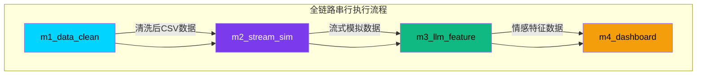

# M5 电商评论情感分析项目

---

## 1. 项目概述 (Project Overview)

**项目名称**: M5 电商评论情感分析全链路整合工程

本项目整合M1-M4四大独立模块，完成**数据清洗 → 流式模拟 → LLM特征提取 → 可视化看板**的一体化流程，对应实验14综合整合任务。

**核心目标**: 构建完整的电商评论分析数据流，实现从原始数据到可视化展示的端到端解决方案。

**全链路调度能力**: 支持完整全链路模式和快速调试模式，自动串行执行m1→m2→m3→m4，解决四大模块代码孤立、无数据流转问题。智能跳过已完成模块，避免重复处理大数据文件。

---

## 2. 系统整体架构 (System Architecture)



**数据流转说明**:
- `m1_data_clean` → `m2_stream_sim`: 输出清洗后的标准化CSV数据，供流式模拟模块使用
- `m2_stream_sim` → `m3_llm_feature`: 生成实时流式数据，模拟电商平台评论实时流入场景
- `m3_llm_feature` → `m4_dashboard`: 提取评论情感特征（正面/负面/中性），供可视化看板展示

**调度说明**:
- 完整全链路模式：按 m1 → m2 → m3 → m4 顺序串行执行，任一模块失败则终止全链路
- 快速调试模式：仅启动m4可视化看板，跳过前置模块

---

## 3. 项目目录结构 (Directory Structure)

```
M5/                              # 项目根目录
├── venv/                        # Python虚拟环境（运行项目必备）
├── reports/                     # 项目报告文档
├── m1_data_clean/               # 【模块1】数据清洗模块
│   └── requirements.txt         # 模块1依赖清单
├── m2_stream_sim/               # 【模块2】流式数据模拟器模块
│   └── requirements.txt         # 模块2依赖清单
├── m3_llm_feature/              # 【模块3】LLM评论特征提取模块
│   └── requirements.txt         # 模块3依赖清单
├── m4_dashboard/                # 【模块4】电商可视化看板模块
│   ├── server.py                # FastAPI后端服务
│   ├── data/                    # 数据文件目录
│   │   └── online_shopping_10_cats.csv  # 评论数据集
│   └── frontend/                # 前端静态文件
│       └── index.html           # 可视化看板页面
├── run_app.py                   # 一键启动脚本（推荐使用，支持全链路调度）
├── requirements.txt             # 全项目统一依赖清单
└── README.md                    # 项目部署说明文档（本文件）
```

---

## 4. 环境部署教程 (Windows专用)

```powershell
# Step 1: 删除旧虚拟环境（确保环境纯净）
Remove-Item -Recurse -Force venv -ErrorAction SilentlyContinue

# Step 2: 新建纯净虚拟环境
python -m venv venv

# Step 3: 激活虚拟环境（激活后命令行前缀会显示 (venv)）
venv\Scripts\Activate.ps1

# Step 4: 一键安装所有依赖（从根目录requirements.txt安装）
pip install -r requirements.txt
```

**部署说明**:
- 推荐使用PowerShell执行以上命令
- 确保已安装Python 3.8+版本
- 首次部署可能需要5-10分钟下载依赖包

---

## 5. 项目启动方式 (Startup)

### 5.1 完整全链路模式（默认）

```powershell
python run_app.py
```

**执行流程**:
1. 环境自检 → 端口检测 → 自动释放占用端口
2. **智能跳过检测**: 检查各模块输出文件是否已存在，已完成的模块自动跳过
3. 串行执行未完成的模块: m1_data_clean → m2_stream_sim → m3_llm_feature
4. 所有前置模块执行成功后，启动 m4_dashboard 可视化服务
5. 自动打开浏览器访问可视化看板

**智能跳过机制**:
- m1_data_clean: 检测 `m1_data_clean/data/m1_final_clean.parquet`
- m2_stream_sim: 检测 `m2_stream_sim/model.pkl`
- m3_llm_feature: 检测 `m3_llm_feature/data/online_shopping_10_cats.csv`

**适用场景**: 首次启动、完整数据流程测试、生产环境运行

**示例输出**:
```
[INFO] === 开始全链路执行 ===
[INFO] 执行顺序: m1_data_clean → m2_stream_sim → m3_llm_feature
[INFO] 检测已存在的输出文件，可跳过重复执行
[WARN] 模块 [m1_data_clean] 输出文件已存在，跳过执行
[WARN] 模块 [m2_stream_sim] 输出文件已存在，跳过执行
[WARN] 模块 [m3_llm_feature] 输出文件已存在，跳过执行
[SUCCESS] === 全链路前置模块执行完成 ===
```

### 5.2 快速调试看板模式（跳过前置模块）

```powershell
python run_app.py --dashboard-only
```

**执行流程**:
1. 环境自检 → 端口检测 → 自动释放占用端口
2. 直接启动 m4_dashboard 可视化服务（跳过m1/m2/m3）
3. 自动打开浏览器访问可视化看板

**适用场景**: 前端页面调试、看板功能测试、快速预览

### 5.3 备用启动方式

```powershell
# 直接启动FastAPI服务
cd m4_dashboard
uvicorn server:app --host 0.0.0.0 --port 8001
```

**访问信息**:
- 前端页面: `http://127.0.0.1:8001`
- API接口: `http://127.0.0.1:8001/docs` (Swagger文档)
- 关闭服务: 在终端按 `Ctrl+C`（优雅关闭，释放端口）

---

## 6. 四大模块功能简介

### m1_data_clean - 数据清洗模块
- **功能**: 处理原始电商评论数据，去除噪声数据、格式化文本、统一编码
- **输出**: 标准化CSV格式的干净数据集
- **入口脚本**: `run_m1_pipeline.py`

### m2_stream_sim - 流式数据模拟器模块
- **功能**: 模拟真实电商平台的评论实时流入场景
- **用途**: 测试流式数据处理能力，验证实时分析Pipeline
- **入口脚本**: `train_model.py`

### m3_llm_feature - LLM评论特征提取模块
- **功能**: 使用预训练大语言模型提取评论的情感特征
- **输出**: 每条评论的情感标签（正面/负面/中性）及置信度
- **入口脚本**: `llm_batch_extract.py`

### m4_dashboard - 电商可视化看板模块
- **功能**: 提供交互式数据可视化界面
- **包含组件**: 品类分布柱状图、情感分布堆叠图、词云图、评论列表
- **入口脚本**: `server.py`（FastAPI服务）

---

## 7. GitHub开源地址与版本控制 (GitHub Repository)

### 7.1 远程仓库信息
- **仓库地址**: `https://github.com/Benjamin-216/bigdata-m1-pipeline`
- **仓库演进**: 从M1数据清洗模块迭代至M5全链路整合工程，包含数据清洗、流式模拟、LLM特征提取、可视化看板四大模块

### 7.2 Windows Git操作流程

```powershell
# Step 1: 初始化Git仓库（首次使用）
git init

# Step 2: 关联远程仓库
git remote add origin https://github.com/Benjamin-216/bigdata-m1-pipeline

# Step 3: 查看远程仓库配置
git remote -v

# Step 4: 文件校验 - 检查.gitignore是否生效
git status

# Step 5: 添加所有文件（自动排除.gitignore中指定的文件）
git add .

# Step 6: 规范提交（遵循Conventional Commits格式）
git commit -m "feat(all): integrate end-to-end pipeline with robust optimization"

# Step 7: 推送至远程仓库（main分支）
git push -u origin main
```

### 7.3 验收步骤
1. 打开GitHub网页访问仓库地址
2. 检查仓库目录结构是否完整清晰
3. 确认无大体积CSV/DB/parquet文件上传
4. 验证.gitignore文件已正确配置
5. 查看提交历史，确认Commit Message符合规范

---

## 8. 常见问题故障排查 (Troubleshooting)

### 问题1: 端口8000持续占用
**现象**: 启动时提示端口被占用
**解决方案**:
```powershell
# 查看8000端口占用情况
netstat -ano | findstr :8000
# 根据PID强制终止进程（替换<PID>为实际进程ID）
taskkill /F /PID <PID>
```
**提示**: run_app.py已默认使用8001端口，避免与其他服务冲突

### 问题2: 看板提示「数据未加载」
**原因**: CSV文件路径配置错误
**解决方案**: 修改 `m4_dashboard/server.py` 中的数据路径
- 将 `../data/online_shopping_10_cats.csv` 改为 `./data/online_shopping_10_cats.csv`

### 问题3: requirements.txt GBK编码报错
**现象**: pip安装时提示"GBK编码解码错误"
**解决方案**:
- 确保requirements.txt使用UTF-8编码（无BOM）
- 使用记事本打开 → 另存为 → 编码选择"UTF-8"

### 问题4: 情感柱状图拥挤重叠
**现象**: 图表柱子过窄、文字重叠
**解决方案**: 修改 `frontend/index.html` 中的ECharts配置:
```javascript
barWidth: 28,                    // 柱子宽度28px
barGap: '40%',                   // 类目间隙40%
grid: { left: 60, right: 30, top: 80, bottom: 60 }  // 画布边距
```

### 问题5: 全链路某模块执行失败
**现象**: 启动时提示某模块执行失败，全链路终止
**排查步骤**:
1. 查看终端错误日志，定位失败的模块名称
2. 检查对应模块的入口脚本是否存在：
   - m1: `m1_data_clean/run_m1_pipeline.py`
   - m2: `m2_stream_sim/train_model.py`
   - m3: `m3_llm_feature/llm_batch_extract.py`
3. 手动进入模块目录执行脚本，查看详细错误信息：
```powershell
cd m1_data_clean
python run_m1_pipeline.py
```
4. 检查模块依赖是否安装完整
5. 确认模块执行所需的数据文件是否存在

### 问题6: DuckDB数据库锁报错
**现象**: 终端提示数据库锁冲突，无法查询数据
**原因**: DuckDB数据库被流式写入进程占用，导致查询连接失败
**解决方案**:
- 系统已实现**读写分离**机制，所有查询使用只读连接(read_only=True)
- 控制台日志区分「只读查询连接」(蓝色)和「流式写入连接」(绿色)
- 锁冲突时系统自动重试，前端返回友好提示而非崩溃堆栈
- 查看系统状态API确认数据库状态: `http://localhost:8001/api/system-status`

### 问题7: 缺失中间数据文件
**现象**: 启动时提示数据文件不存在
**解决方案**:
- 系统已实现**自动重生成机制**，检测到核心数据集缺失时自动调用m1_data_clean清洗脚本重新生成
- 控制台输出黄色告警日志，显示重生成进度
- 前端接口返回标准化错误提示，附带修复指引
- 重生成失败时服务继续运行，仅影响相关功能模块

### 问题8: LLM API Key缺失
**现象**: 控制台显示红色警告，LLM功能不可用
**解决方案**:
- 系统已实现**安全降级机制**，未配置API Key时自动切换本地规则词库计算情感
- 支持环境变量: `SILICONFLOW_API_KEY` 或 `DASHSCOPE_API_KEY`
- 配置方式(Windows PowerShell):
```powershell
$env:SILICONFLOW_API_KEY="your_api_key_here"
python run_app.py
```
- 看板顶部显示橙色提示横幅，不影响基础数据查看
- 查看系统状态API确认LLM状态: `http://localhost:8001/api/system-status`

---

## 8. 实验任务完成说明 (Task Completion)

### 实验14 综合整合任务完成情况:

| 任务编号 | 任务内容 | 完成状态 |
|----------|----------|----------|
| **Task 1** | 一键启动脚本 `run_app.py` - 包含服务编排、端口自检、自动打开可视化页面；**已拓展全链路串联调度能力**，支持完整模式和快速调试模式，解决m1/m2/m3/m4四大模块代码孤立问题 | ✅ 已完成 |
| **Task 2** | 整合全模块依赖，生成根目录统一 `requirements.txt` - 纯净环境可完整部署 | ✅ 已完成 |
| **Task 3** | 标准化项目README部署文档，内置Mermaid可渲染系统架构图 | ✅ 已完成 |
| **Task 4** | 防御性编程与系统健壮性优化 - 三大优化点：DuckDB并发锁冲突修复（读写分离）、文件缺失零崩溃降级（自动重生成）、LLM API Key缺失安全降级（本地规则词库兜底） | ✅ 已完成 |
| **Task 5** | Git规范管理与仓库同步 - 生成精细化.gitignore、符合Conventional Commits规范的Commit Message、更新README GitHub板块 | ✅ 已完成 |

**项目状态**: 全部任务已完成，可正常运行

**全链路调度拓展说明**:
- ✅ 双启动运行模式（完整全链路模式 / 快速调试看板模式）
- ✅ 跨模块子进程串行调度逻辑（m1→m2→m3→m4）
- ✅ 智能跳过已完成模块（检测输出文件，避免重复处理大数据）
- ✅ 进程资源统一管理（Ctrl+C中断时同步终止所有子进程）
- ✅ 分段彩色日志输出（标注各模块执行状态）
- ✅ 异常处理（任一模块失败自动终止全链路）
- ✅ Windows环境兼容（taskkill进程树、端口自动释放）

**健壮性优化说明（Task 4）**:
- ✅ DuckDB并发锁冲突修复：封装数据库连接工具函数，只读连接使用read_only=True参数，控制台日志区分读写连接类型
- ✅ 文件缺失零崩溃降级：所有IO操作套try-except兜底，核心数据集缺失时自动调用m1_data_clean脚本重新生成
- ✅ LLM API Key缺失安全降级：服务启动时读取环境变量，未配置时切换本地规则词库，新增/api/system-status健康检测接口
- ✅ 前端降级提示：页面轮询系统状态，LLM未激活时显示橙色提示横幅，不遮挡核心业务区域