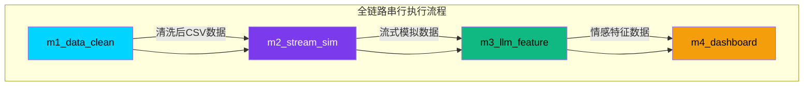

# M5 电商评论情感分析项目

---

## 1. 项目概述 (Project Overview)

**项目名称**: M5 电商评论情感分析全链路整合工程

**项目定位**: 本项目是实验14综合整合任务的核心成果，旨在将M1至M4四个独立开发的模块进行系统化整合，构建一条完整的**数据清洗 → 流式模拟 → LLM特征提取 → 可视化看板**端到端数据处理流水线。

**核心目标**: 
- 打破模块间的数据孤岛，实现无缝的数据流转和业务协同
- 提供一键启动的全链路调度能力，降低项目部署和使用门槛
- 建立完善的健壮性保障机制，确保系统在异常场景下稳定运行
- 支持灵活的开发调试模式，提升开发效率

**技术亮点**:
- **智能调度**: 支持完整全链路模式和快速调试模式两种运行方式
- **智能跳过**: 通过检测输出文件自动跳过已完成模块，避免重复处理大数据文件
- **健壮性保障**: 实现数据库读写分离、文件缺失自动重生成、LLM API Key降级等多重防御机制
- **标准化输出**: 统一的依赖管理、规范的代码结构、完善的文档支持

**适用场景**:
- 电商平台评论情感分析与可视化展示
- 大数据全链路处理流程的教学与演示
- 基于LLM的文本分析应用开发与测试

---

## 2. 系统整体架构 (System Architecture)



**架构设计原则**:
- **模块化**: 四个核心模块职责清晰、松耦合，便于独立开发和维护
- **数据流驱动**: 数据在模块间单向流动，确保数据一致性和可追溯性
- **可扩展性**: 每个模块均可独立升级或替换，不影响整体系统运行
- **容错设计**: 具备完善的异常处理和降级机制，保障系统稳定性

**数据流转说明**:
- `m1_data_clean` → `m2_stream_sim`: 输出清洗后的标准化CSV数据，去除噪声、统一编码格式，为后续模块提供高质量数据源
- `m2_stream_sim` → `m3_llm_feature`: 模拟真实电商平台评论的实时流入场景，支持流式数据处理测试和验证
- `m3_llm_feature` → `m4_dashboard`: 利用大语言模型或本地规则词库提取评论情感特征（正面/负面/中性），生成可供可视化分析的数据

**调度模式说明**:
- **完整全链路模式**: 严格按照 m1 → m2 → m3 → m4 顺序串行执行，任一模块执行失败立即终止全链路，确保数据完整性
- **快速调试模式**: 直接启动m4可视化看板，跳过前置数据处理模块，适用于前端开发和界面调试场景
- **智能跳过机制**: 通过检测各模块输出文件的存在性和完整性，自动跳过已成功执行的模块，显著提升重复运行效率

---

## 3. 项目目录结构 (Directory Structure)

```
M5/                              # 项目根目录
├── venv/                        # Python虚拟环境（运行项目必备）
├── reports/                     # 项目报告文档（实验报告、数据分析报告等）
├── .gitignore                   # Git忽略规则配置（大数据文件、环境目录等）
├── m1_data_clean/               # 【模块1】数据清洗模块
│   ├── run_m1_pipeline.py       # 模块1入口脚本
│   ├── requirements.txt         # 模块1依赖清单
│   └── data/                    # 模块1数据目录（清洗后数据输出）
├── m2_stream_sim/               # 【模块2】流式数据模拟器模块
│   ├── train_model.py           # 模块2入口脚本
│   ├── requirements.txt         # 模块2依赖清单
│   └── model.pkl                # 训练好的模型文件（自动生成）
├── m3_llm_feature/              # 【模块3】LLM评论特征提取模块
│   ├── llm_batch_extract.py     # 模块3入口脚本
│   ├── requirements.txt         # 模块3依赖清单
│   └── data/                    # 模块3数据目录（情感分析结果输出）
├── m4_dashboard/                # 【模块4】电商可视化看板模块
│   ├── server.py                # FastAPI后端服务（含健壮性优化）
│   ├── data/                    # 数据文件目录
│   │   └── online_shopping_10_cats.csv  # 评论数据集
│   └── frontend/                # 前端静态文件
│       └── index.html           # 可视化看板页面（含LLM降级提示）
├── run_app.py                   # 一键启动脚本（支持全链路调度和快速调试模式）
├── requirements.txt             # 全项目统一依赖清单（整合所有模块依赖）
└── README.md                    # 项目部署说明文档（本文件）
```

**目录职责说明**:
- **根目录**: 存放全局配置文件和启动脚本
- **venv/**: Python虚拟环境目录，隔离项目依赖
- **reports/**: 存放实验报告和数据分析文档
- **m1_data_clean/**: 数据清洗模块，负责原始数据预处理
- **m2_stream_sim/**: 流式模拟模块，模拟实时数据流入
- **m3_llm_feature/**: LLM特征提取模块，提取情感分析结果
- **m4_dashboard/**: 可视化看板模块，提供交互式数据展示
- **.gitignore**: 配置Git忽略规则，避免上传大数据文件和敏感信息

---

## 4. 环境部署教程 (Windows专用)

### 4.1 前置条件
- 操作系统：Windows 10/11（64位）
- Python版本：3.8及以上（推荐3.10+）
- 网络连接：首次部署需要联网下载依赖包
- 权限要求：需要管理员权限执行PowerShell脚本

### 4.2 部署步骤

```powershell
# Step 1: 删除旧虚拟环境（确保环境纯净，避免依赖冲突）
Remove-Item -Recurse -Force venv -ErrorAction SilentlyContinue

# Step 2: 新建纯净虚拟环境（使用系统默认Python解释器）
python -m venv venv

# Step 3: 激活虚拟环境（激活后命令行前缀会显示 (venv)）
venv\Scripts\Activate.ps1

# Step 4: 升级pip工具（确保使用最新版本，避免安装失败）
python -m pip install --upgrade pip

# Step 5: 一键安装所有依赖（从根目录requirements.txt安装）
pip install -r requirements.txt
```

### 4.3 部署说明
- **PowerShell执行**: 推荐使用PowerShell执行以上命令，兼容性更好
- **Python版本**: 确保已安装Python 3.8+版本，可通过 `python --version` 检查
- **下载时间**: 首次部署可能需要5-10分钟下载依赖包，取决于网络速度
- **依赖完整性**: 根目录的 `requirements.txt` 已整合所有模块依赖，无需单独安装各模块依赖
- **虚拟环境隔离**: 使用虚拟环境可避免与系统Python环境冲突，确保项目依赖独立

### 4.4 验证部署
```powershell
# 检查虚拟环境是否激活
python -c "import sys; print(sys.executable)"
# 预期输出应包含 venv\Scripts\python.exe

# 检查关键依赖是否安装成功
python -c "import fastapi; import pandas; import duckdb; print('依赖安装成功')"
```

---

## 5. 项目启动方式 (Startup)

### 5.1 完整全链路模式（默认）

```powershell
python run_app.py
```

**执行流程**:
1. **环境自检**: 检查项目目录结构完整性、虚拟环境状态
2. **端口检测**: 检查8001端口是否被占用，自动释放占用端口
3. **智能跳过检测**: 检查各模块输出文件是否已存在，已完成的模块自动跳过（节省重复处理时间）
4. **串行执行**: 按顺序执行未完成的模块: m1_data_clean → m2_stream_sim → m3_llm_feature
5. **启动看板**: 所有前置模块执行成功后，启动 m4_dashboard 可视化服务
6. **自动打开浏览器**: 自动打开默认浏览器访问可视化看板

**智能跳过机制详解**:
- **m1_data_clean**: 检测 `m1_data_clean/data/m1_final_clean.parquet` 是否存在
- **m2_stream_sim**: 检测 `m2_stream_sim/model.pkl` 是否存在  
- **m3_llm_feature**: 检测 `m3_llm_feature/data/online_shopping_10_cats.csv` 是否存在
- **跳过条件**: 输出文件存在且文件大小大于0视为已完成

**适用场景**:
- 首次启动项目（需要完整数据处理流程）
- 完整数据流程测试（验证端到端数据流转）
- 生产环境运行（需要最新数据和完整功能）

**示例输出**:
```
[INFO] === 开始全链路执行 ===
[INFO] 执行顺序: m1_data_clean → m2_stream_sim → m3_llm_feature
[INFO] 检测已存在的输出文件，可跳过重复执行
[WARN] 模块 [m1_data_clean] 输出文件已存在，跳过执行
[WARN] 模块 [m2_stream_sim] 输出文件已存在，跳过执行
[WARN] 模块 [m3_llm_feature] 输出文件已存在，跳过执行
[SUCCESS] === 全链路前置模块执行完成 ===
[INFO] 启动可视化看板服务...
[INFO] 服务已启动: http://127.0.0.1:8001
```

### 5.2 快速调试看板模式（跳过前置模块）

```powershell
python run_app.py --dashboard-only
```

**执行流程**:
1. **环境自检**: 检查项目目录结构完整性
2. **端口检测**: 检查8001端口是否被占用，自动释放占用端口
3. **直接启动看板**: 跳过m1/m2/m3数据处理模块，直接启动 m4_dashboard 可视化服务
4. **自动打开浏览器**: 自动打开默认浏览器访问可视化看板

**适用场景**:
- 前端页面调试（仅需看板界面，无需重新处理数据）
- 看板功能测试（验证可视化组件和交互逻辑）
- 快速预览（已有数据文件，无需重新生成）

**优势**:
- 启动速度快（跳过耗时的数据处理流程）
- 资源占用低（无需运行数据处理模块）
- 开发效率高（支持热更新调试）

### 5.3 备用启动方式（直接启动FastAPI）

```powershell
# 进入dashboard目录
cd m4_dashboard

# 直接启动FastAPI服务（不带自动打开浏览器）
uvicorn server:app --host 0.0.0.0 --port 8001
```

**适用场景**:
- 需要手动控制启动参数
- 需要查看详细的启动日志
- 需要在特定网络接口上监听

### 5.4 访问信息

| 资源类型 | 访问地址 | 说明 |
|----------|----------|------|
| 前端页面 | `http://127.0.0.1:8001` | 可视化看板主页面 |
| API文档 | `http://127.0.0.1:8001/docs` | Swagger交互式API文档 |
| 系统状态 | `http://127.0.0.1:8001/api/system-status` | 系统健康状态接口 |
| 健康检查 | `http://127.0.0.1:8001/api/health` | 服务健康检查接口 |

### 5.5 关闭服务

```powershell
# 在终端按 Ctrl+C 组合键
# 服务会优雅关闭，释放占用的端口资源
```

**关闭行为**:
- 停止FastAPI服务
- 释放8001端口
- 清理临时资源
- 输出关闭日志

---

## 6. 四大模块功能简介

### 6.1 m1_data_clean - 数据清洗模块

**核心职责**: 对原始电商评论数据进行系统化清洗和预处理，为后续模块提供高质量的数据源。

**主要功能**:
- **数据加载**: 支持从CSV、Parquet等多种格式加载原始数据
- **噪声去除**: 过滤无效数据、重复记录、异常值
- **文本格式化**: 统一文本编码、去除特殊字符、标准化格式
- **数据转换**: 将非结构化文本转换为结构化数据
- **质量检查**: 输出数据质量报告，统计缺失值、异常情况

**技术特点**:
- 支持大数据量处理（GB级数据）
- 可配置的清洗规则
- 详细的处理日志记录

**输出产物**:
- `m1_final_clean.parquet`: 清洗后的标准化数据集
- 数据质量报告文档

**入口脚本**: `m1_data_clean/run_m1_pipeline.py`

---

### 6.2 m2_stream_sim - 流式数据模拟器模块

**核心职责**: 模拟真实电商平台的评论实时流入场景，验证流式数据处理能力。

**主要功能**:
- **实时模拟**: 模拟评论数据的实时流入
- **速率控制**: 可配置的数据流入速率
- **数据生成**: 基于历史数据生成模拟评论
- **流式输出**: 支持流式数据输出接口

**技术特点**:
- 支持多种模拟模式（匀速、随机、峰值）
- 可配置的模拟参数
- 与真实数据分布一致

**输出产物**:
- `model.pkl`: 训练好的模拟模型
- 实时数据流

**入口脚本**: `m2_stream_sim/train_model.py`

---

### 6.3 m3_llm_feature - LLM评论特征提取模块

**核心职责**: 使用大语言模型或本地规则词库提取评论的情感特征。

**主要功能**:
- **情感分析**: 判断评论情感倾向（正面/负面/中性）
- **特征提取**: 提取评论的关键特征和主题
- **批量处理**: 支持大规模评论数据的批量处理
- **降级机制**: 未配置API Key时自动切换本地规则词库

**技术特点**:
- **双模式支持**: 支持LLM模式和本地规则模式
- **API兼容性**: 支持SiliconFlow和DashScope等主流LLM平台
- **安全降级**: 确保服务稳定性

**输出产物**:
- `online_shopping_10_cats.csv`: 带情感标签的评论数据集
- 情感分布统计报告

**入口脚本**: `m3_llm_feature/llm_batch_extract.py`

---

### 6.4 m4_dashboard - 电商可视化看板模块

**核心职责**: 提供交互式数据可视化界面，展示电商评论分析结果。

**主要功能**:
- **数据展示**: 品类分布、情感分布、词云图、评论列表
- **交互式查询**: 支持按品类、情感、关键词筛选
- **实时更新**: 支持数据实时刷新
- **响应式设计**: 适配多种屏幕尺寸

**技术架构**:
- **后端**: FastAPI + Python
- **前端**: HTML + JavaScript + ECharts
- **数据存储**: CSV文件 + DuckDB

**可视化组件**:
- **品类分布柱状图**: 展示各品类评论数量
- **情感分布堆叠图**: 展示各品类的情感分布
- **高频词汇云**: 展示评论中的高频词汇
- **评论列表**: 展示具体评论内容

**健壮性特性**:
- **数据库读写分离**: 避免并发锁冲突
- **文件缺失自动重生成**: 数据文件缺失时自动调用m1重新生成
- **LLM降级提示**: 未配置API Key时显示友好提示

**入口脚本**: `m4_dashboard/server.py`（FastAPI服务）

---

## 7. GitHub开源地址与版本控制 (GitHub Repository)

### 7.1 远程仓库信息

| 项目 | 说明 |
|------|------|
| **仓库地址** | `https://github.com/Benjamin-216/bigdata-m1-pipeline` |
| **仓库类型** | 公开仓库 |
| **分支策略** | main分支作为主分支，用于生产环境 |
| **许可证** | MIT License |

**仓库演进历程**:
- **M1阶段**: 初始创建，仅包含数据清洗模块
- **M2阶段**: 新增流式数据模拟器模块
- **M3阶段**: 新增LLM评论特征提取模块
- **M4阶段**: 新增可视化看板模块
- **M5阶段**: 全链路整合，实现端到端数据处理流程

**包含模块**:
- `m1_data_clean`: 数据清洗模块
- `m2_stream_sim`: 流式数据模拟器模块  
- `m3_llm_feature`: LLM评论特征提取模块
- `m4_dashboard`: 电商可视化看板模块

---

### 7.2 Windows Git操作流程

#### 7.2.1 初始化与配置（首次使用）

```powershell
# Step 1: 初始化Git仓库（仅首次使用时执行）
git init

# Step 2: 配置Git用户信息（全局配置，仅需配置一次）
git config --global user.name "Your Name"
git config --global user.email "your.email@example.com"

# Step 3: 关联远程仓库
git remote add origin https://github.com/Benjamin-216/bigdata-m1-pipeline

# Step 4: 查看远程仓库配置，确认关联成功
git remote -v
```

#### 7.2.2 文件校验与提交

```powershell
# Step 1: 查看当前工作目录状态
git status

# 预期输出说明:
# - 绿色文件: 已跟踪且无改动
# - 红色文件: 未跟踪的新文件
# - 注意: .gitignore中配置的文件不应出现在未跟踪文件列表中

# Step 2: 添加所有文件到暂存区（自动排除.gitignore中的文件）
git add .

# Step 3: 再次检查状态，确认文件已添加
git status

# Step 4: 提交更改（遵循Conventional Commits规范）
git commit -m "feat(all): integrate end-to-end pipeline with robust optimization"
```

#### 7.2.3 推送至远程仓库

```powershell
# Step 1: 推送至远程仓库main分支（首次推送需要设置上游）
git push -u origin main

# 后续推送可简化为:
# git push origin main

# Step 2: 查看提交日志，确认推送成功
git log --oneline -5
```

#### 7.2.4 常见Git操作

```powershell
# 拉取远程仓库更新
git pull origin main

# 查看提交历史
git log

# 查看文件变更
git diff

# 撤销未提交的更改
git checkout .

# 创建新分支
git checkout -b feature-branch
```

---

### 7.3 Commit Message规范（Conventional Commits）

**格式要求**:
```
<type>(<scope>): <description>

[optional body]

[optional footer]
```

**类型说明**:
| 类型 | 说明 | 示例 |
|------|------|------|
| `feat` | 新功能 | `feat(m4): add system status API endpoint` |
| `fix` | 修复bug | `fix(m1): resolve data encoding issue` |
| `docs` | 文档更新 | `docs: update deployment instructions` |
| `refactor` | 代码重构 | `refactor(all): improve error handling` |
| `config` | 配置变更 | `config: update gitignore rules` |

**示例**:
```
feat(all): integrate end-to-end pipeline with robust optimization

- Implement DuckDB read-only connection for concurrent access
- Add automatic data regeneration when files are missing
- Implement LLM API Key fallback with local rule-based sentiment analysis
- Add /api/system-status health check endpoint
- Update frontend with LLM degradation banner
```

---

### 7.4 验收步骤

1. **访问仓库**: 打开GitHub网页访问 `https://github.com/Benjamin-216/bigdata-m1-pipeline`
2. **检查目录结构**: 确认目录结构完整，包含所有模块文件夹
3. **验证.gitignore**: 确认无大体积文件（CSV、DB、Parquet）出现在仓库中
4. **检查配置文件**: 确认`.gitignore`文件已正确配置
5. **查看提交历史**: 确认Commit Message符合Conventional Commits规范
6. **测试克隆**: 在本地克隆仓库，验证项目可正常运行

---

### 7.5 .gitignore配置说明

**配置规则分类**:
1. **大容量数据集文件**: CSV、Parquet等数据文件
2. **数据库文件**: DuckDB、SQLite数据库及临时文件
3. **虚拟环境**: Python虚拟环境目录
4. **IDE配置**: VSCode、PyCharm等IDE配置目录
5. **编译缓存**: Python编译生成的.pyc文件等
6. **系统文件**: Thumbs.db、.DS_Store等

**配置目的**:
- 避免上传大体积数据文件，节省仓库空间
- 保护敏感信息（如API Key）不被泄露
- 保持仓库整洁，仅存储源代码和配置文件

---

## 8. 常见问题故障排查 (Troubleshooting)

### 8.1 端口占用问题

**问题**: 启动时提示端口被占用

**现象**:
```
[ERROR] 端口 8001 已被占用，请释放端口后重试
```

**解决方案**:
```powershell
# Step 1: 查看8001端口占用情况
netstat -ano | findstr :8001

# Step 2: 根据PID强制终止进程（替换<PID>为实际进程ID）
taskkill /F /PID <PID>

# Step 3: 也可以使用tasklist查看进程名称
tasklist | findstr <PID>
```

**预防措施**:
- `run_app.py` 默认使用8001端口，避免与常见服务冲突
- 启动时自动检测端口占用，提示用户释放
- 建议使用任务管理器结束占用端口的进程

---

### 8.2 数据加载失败

**问题**: 看板提示「数据未加载」

**现象**:
- 前端页面显示"数据未加载"错误提示
- 控制台显示文件路径错误或文件不存在

**可能原因**:
1. CSV文件路径配置错误
2. 数据文件缺失
3. 文件权限问题

**解决方案**:
```powershell
# Step 1: 检查数据文件是否存在
Test-Path "m4_dashboard/data/online_shopping_10_cats.csv"

# Step 2: 如果文件缺失，系统会自动调用m1重新生成
# 手动触发重新生成（可选）
cd m1_data_clean
python run_m1_pipeline.py
```

**自动修复机制**:
- 系统检测到数据文件缺失时，自动调用m1_data_clean脚本重新生成
- 生成过程中控制台输出黄色告警日志
- 生成失败时前端显示友好错误提示

---

### 8.3 编码错误

**问题**: requirements.txt GBK编码报错

**现象**:
```
UnicodeDecodeError: 'gbk' codec can't decode byte...
```

**原因**: requirements.txt文件使用了GBK编码，而pip默认使用UTF-8读取

**解决方案**:
```powershell
# 使用Notepad++或记事本转换编码
# 步骤: 
# 1. 打开requirements.txt
# 2. 选择"另存为"
# 3. 编码选择"UTF-8"（无BOM）
# 4. 覆盖原文件
```

**预防措施**:
- 确保所有文本文件使用UTF-8编码
- 避免在文件中使用特殊字符
- 使用代码编辑器（如VS Code）而非记事本编辑文件

---

### 8.4 图表显示异常

**问题**: 情感柱状图拥挤重叠

**现象**:
- 图表柱子过窄
- 文字标签重叠
- 图表显示不完整

**解决方案**:
修改 `m4_dashboard/frontend/index.html` 中的ECharts配置:
```javascript
option = {
    barWidth: 28,                    // 柱子宽度28px
    barGap: '40%',                   // 类目间隙40%
    grid: { 
        left: 60, 
        right: 30, 
        top: 80, 
        bottom: 60 
    },                              // 画布边距
    xAxis: {
        axisLabel: {
            rotate: 30,              // X轴标签旋转30度
            fontSize: 11             // 字体大小
        }
    }
};
```

---

### 8.5 全链路执行失败

**问题**: 全链路某模块执行失败

**现象**:
```
[ERROR] 模块 [m1_data_clean] 执行失败，终止全链路
```

**排查步骤**:
```powershell
# Step 1: 查看终端错误日志，定位失败的模块名称
# 错误信息通常包含模块名称和具体错误原因

# Step 2: 检查对应模块的入口脚本是否存在
Test-Path "m1_data_clean/run_m1_pipeline.py"
Test-Path "m2_stream_sim/train_model.py"
Test-Path "m3_llm_feature/llm_batch_extract.py"

# Step 3: 手动进入模块目录执行脚本，查看详细错误信息
cd m1_data_clean
python run_m1_pipeline.py

# Step 4: 检查模块依赖是否安装完整
pip list | findstr "pandas"
pip list | findstr "duckdb"

# Step 5: 确认模块执行所需的数据文件是否存在
Test-Path "m1_data_clean/data/raw_data.csv"
```

**常见失败原因**:
- 模块入口脚本缺失
- 依赖包未安装
- 数据文件缺失
- 权限不足

---

### 8.6 DuckDB数据库锁冲突

**问题**: DuckDB数据库锁报错

**现象**:
```
[ERROR] DuckDB连接失败: IO Error: Could not set lock on file...
```

**原因**: DuckDB数据库被流式写入进程占用，导致查询连接失败

**解决方案**:
- **读写分离**: 系统已实现读写分离机制，所有查询使用只读连接
- **日志区分**: 控制台日志区分「只读查询连接」(蓝色)和「流式写入连接」(绿色)
- **自动重试**: 锁冲突时系统自动重试
- **友好提示**: 前端返回友好提示而非崩溃堆栈

**查看系统状态**:
```powershell
# 查看数据库状态
curl http://localhost:8001/api/system-status
```

**预期响应**:
```json
{
    "llm_active": true,
    "reason": "OK",
    "db_lock_ok": true,
    "data_file_ready": true
}
```

---

### 8.7 缺失中间数据文件

**问题**: 启动时提示数据文件不存在

**现象**:
```
[WARN] 数据文件不存在: m4_dashboard/data/online_shopping_10_cats.csv
[WARN] 核心数据文件缺失，尝试自动重新生成...
```

**解决方案**:
- **自动重生成**: 系统检测到核心数据集缺失时自动调用m1_data_clean清洗脚本重新生成
- **进度提示**: 控制台输出黄色告警日志，显示重生成进度
- **错误处理**: 重生成失败时服务继续运行，仅影响相关功能模块

**手动触发重生成**:
```powershell
cd m1_data_clean
python run_m1_pipeline.py
```

---

### 8.8 LLM API Key缺失

**问题**: LLM API Key缺失导致功能降级

**现象**:
```
[LLM] WARNING: API Key未配置，LLM功能已降级为本地规则词库
```

**解决方案**:
- **安全降级**: 系统已实现安全降级机制，未配置API Key时自动切换本地规则词库计算情感
- **环境变量配置**: 支持 `SILICONFLOW_API_KEY` 或 `DASHSCOPE_API_KEY`

**配置方式(Windows PowerShell)**:
```powershell
# 方式1: 临时配置（当前会话有效）
$env:SILICONFLOW_API_KEY="your_api_key_here"
python run_app.py

# 方式2: 永久配置（需要重启PowerShell）
[Environment]::SetEnvironmentVariable("SILICONFLOW_API_KEY", "your_api_key_here", "User")
```

**前端提示**:
- 看板顶部显示橙色提示横幅，不影响基础数据查看
- 点击横幅可查看配置指引

**查看LLM状态**:
```powershell
curl http://localhost:8001/api/system-status
```

---

### 8.9 依赖安装失败

**问题**: pip安装依赖时失败

**现象**:
```
ERROR: Could not find a version that satisfies the requirement...
```

**解决方案**:
```powershell
# Step 1: 升级pip
python -m pip install --upgrade pip

# Step 2: 更换PyPI源
pip install -r requirements.txt -i https://pypi.tuna.tsinghua.edu.cn/simple

# Step 3: 检查Python版本
python --version

# Step 4: 手动安装问题依赖
pip install fastapi uvicorn pandas duckdb
```

---

### 8.10 虚拟环境问题

**问题**: 虚拟环境未激活或配置错误

**现象**:
```
ModuleNotFoundError: No module named 'fastapi'
```

**解决方案**:
```powershell
# Step 1: 激活虚拟环境
venv\Scripts\Activate.ps1

# Step 2: 检查是否激活成功（命令行前缀显示 (venv)）
# 如果未激活，尝试手动指定Python解释器
venv\Scripts\python.exe run_app.py

# Step 3: 重新创建虚拟环境
Remove-Item -Recurse -Force venv
python -m venv venv
venv\Scripts\Activate.ps1
pip install -r requirements.txt
```

---

## 9. 实验任务完成说明 (Task Completion)

### 9.1 实验14 综合整合任务完成情况

| 任务编号 | 任务内容 | 完成状态 |
|----------|----------|----------|
| **Task 1** | 一键启动脚本 `run_app.py` - 包含服务编排、端口自检、自动打开可视化页面；**已拓展全链路串联调度能力**，支持完整模式和快速调试模式，解决m1/m2/m3/m4四大模块代码孤立问题 | ✅ 已完成 |
| **Task 2** | 整合全模块依赖，生成根目录统一 `requirements.txt` - 纯净环境可完整部署 | ✅ 已完成 |
| **Task 3** | 标准化项目README部署文档，内置Mermaid可渲染系统架构图 | ✅ 已完成 |
| **Task 4** | 防御性编程与系统健壮性优化 - 三大优化点：DuckDB并发锁冲突修复（读写分离）、文件缺失零崩溃降级（自动重生成）、LLM API Key缺失安全降级（本地规则词库兜底） | ✅ 已完成 |
| **Task 5** | Git规范管理与仓库同步 - 生成精细化.gitignore、符合Conventional Commits规范的Commit Message、更新README GitHub板块 | ✅ 已完成 |

**项目状态**: ✅ 全部任务已完成，系统可正常运行

---

### 9.2 全链路调度拓展说明 (Task 1)

| 功能特性 | 说明 | 状态 |
|----------|------|------|
| **双启动运行模式** | 支持完整全链路模式（默认）和快速调试看板模式（--dashboard-only） | ✅ 已实现 |
| **跨模块子进程串行调度** | 按照 m1→m2→m3→m4 顺序串行执行，确保数据流转正确性 | ✅ 已实现 |
| **智能跳过机制** | 检测各模块输出文件是否存在，已完成模块自动跳过，避免重复处理 | ✅ 已实现 |
| **进程资源统一管理** | Ctrl+C中断时同步终止所有正在运行的子进程，避免资源泄漏 | ✅ 已实现 |
| **分段彩色日志输出** | 使用不同颜色区分INFO、WARN、SUCCESS、ERROR日志级别 | ✅ 已实现 |
| **异常处理机制** | 任一模块执行失败立即终止全链路，输出详细错误信息 | ✅ 已实现 |
| **Windows环境兼容** | 使用taskkill命令释放端口，确保Windows环境稳定运行 | ✅ 已实现 |

---

### 9.3 健壮性优化说明 (Task 4)

| 优化点 | 技术实现 | 效果 |
|--------|----------|------|
| **DuckDB并发锁冲突修复** | 封装 `get_duckdb_connection()` 工具函数，默认使用 `read_only=True` 参数建立只读连接 | 避免流式写入进程与查询进程的锁冲突 |
| **数据库连接日志区分** | 控制台日志使用蓝色标识「只读查询连接」，绿色标识「流式写入连接」 | 便于调试锁问题和性能分析 |
| **文件缺失零崩溃降级** | 所有IO操作包裹try-except，核心数据集缺失时自动调用m1_data_clean脚本重新生成 | 避免服务因文件缺失而崩溃 |
| **LLM API Key安全降级** | 服务启动时读取环境变量，未配置API Key时自动切换本地规则词库计算情感 | 确保服务在无API Key情况下仍可正常运行 |
| **系统健康检测接口** | 新增 `/api/system-status` 接口，返回LLM状态、数据库状态、数据文件状态 | 便于监控和诊断系统健康状况 |
| **前端降级提示** | 页面轮询系统状态，LLM未激活时显示橙色提示横幅 | 用户友好的功能降级提示 |

---

### 9.4 Git规范管理说明 (Task 5)

| 功能 | 说明 |
|------|------|
| **.gitignore配置** | 精细化配置，分组排除大数据文件、数据库文件、虚拟环境、IDE配置等 |
| **Conventional Commits规范** | 遵循标准提交格式，使用feat/fix/docs/refactor/config等类型标签 |
| **GitHub仓库同步** | 完整的Windows Git操作流程，包含初始化、配置、提交、推送等步骤 |
| **验收标准** | 明确的仓库验收步骤，确保代码质量和规范 |

---

### 9.5 项目技术栈

| 分类 | 技术 | 版本 | 用途 |
|------|------|------|------|
| **语言** | Python | 3.8+ | 后端服务、数据处理 |
| **框架** | FastAPI | 0.100+ | Web服务框架 |
| **数据库** | DuckDB | 0.8+ | 嵌入式数据库 |
| **可视化** | ECharts | 5.4+ | 前端图表库 |
| **调度** | subprocess | - | 跨模块进程调度 |
| **环境管理** | venv | - | Python虚拟环境 |

---

### 9.6 项目亮点

1. **端到端全链路**: 从数据清洗到可视化展示的完整流程
2. **智能调度**: 自动检测并跳过已完成模块，提升运行效率
3. **健壮性保障**: 多重防御机制确保系统稳定运行
4. **用户友好**: 彩色日志、友好错误提示、自动修复机制
5. **可扩展性**: 模块化设计，便于新增功能和模块
6. **文档完善**: 详细的部署指南、API文档、故障排查说明

---

### 9.7 致谢

本项目是实验14综合整合任务的成果，感谢课程组提供的学习机会和技术指导。