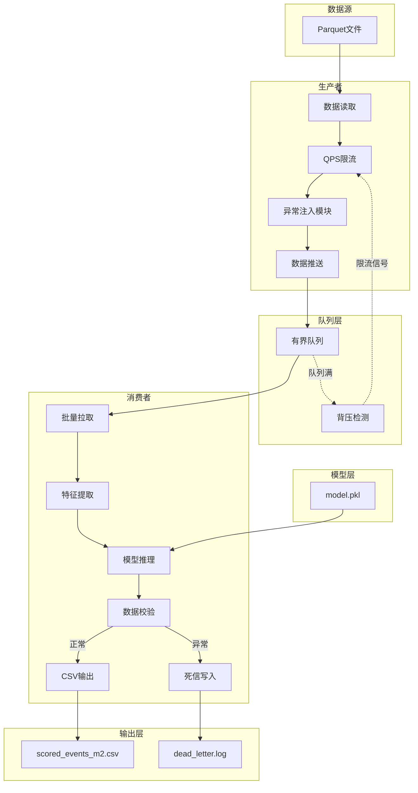

# 实验八 M2 项目交付文档

## 1. 项目简介

本流处理管道实现**电商用户行为预测流式打标**功能，从Parquet文件流式读取用户行为数据（浏览、收藏、加购、购买），通过预训练的机器学习模型实时预测用户购买概率，并将结果持久化输出。

---

## 2. 技术架构



**架构说明**：
- **生产者**：流式读取Parquet数据，支持QPS限流和混沌测试异常注入
- **队列层**：有界队列实现背压机制，队列满时自动触发生产者限流
- **消费者**：批量提取特征进行模型推理，异常数据自动写入死信队列
- **模型层**：预训练的购买预测模型（model.pkl）
- **输出层**：正常结果写入CSV，异常数据记录到死信日志

---

## 3. 快速启动

### 默认运行
```bash
python run_pipeline.py
```
使用默认参数：QPS=50，队列容量=500，批量大小=50，测试时长=60秒

### 压测运行
```bash
python run_pipeline.py --qps 100 --queue_limit 1000 --batch_size 100 --test_time 120 --chaos 0.05
```
启用混沌测试模式，注入5%异常数据

### 帮助命令
```bash
python run_pipeline.py --help
```

---

## 4. 核心特性

### CLI配置
支持灵活的命令行参数配置：
- `--qps`：生产者每秒生产数据量（默认50）
- `--queue_limit`：队列最大容量/背压阈值（默认500）
- `--batch_size`：批量推理大小（默认50）
- `--test_time`：测试运行时长（秒），0表示无限运行（默认60）
- `--chaos`：混沌测试异常注入比例（0-0.05，默认0）

### 背压限流
- 队列满时自动触发背压机制
- 生产者暂停生产，等待队列有空间
- 实时监控背压触发次数

### 死信容错
- 异常数据自动识别和隔离
- 支持4种异常类型：缺失字段、类型错误、空值、无效值
- 异常数据写入`dead_letter.log`，包含时间戳、错误信息和原始数据

### 混沌测试
- 支持随机异常数据注入
- 可配置异常注入比例（0-5%）
- 自动生成混沌测试报告

---

## 5. 交付文件清单

| 文件 | 说明 |
|------|------|
| `run_pipeline.py` | 统一流处理管道主程序 |
| `model.pkl` | 预训练购买预测模型 |
| `scored_events_m2.csv` | 打标结果输出文件 |
| `dead_letter.log` | 异常数据死信日志 |
| `backpressure_metrics.csv` | 背压测试指标数据 |
| `perturbation_metrics.csv` | 混沌测试扰动指标 |

---

## 6. 运行结果

### 本次混沌测试关键指标

| 指标 | 数值 |
|------|------|
| **测试时长** | 约60秒 |
| **混沌注入比例** | 5% |
| **生产总量** | 约3,000条 |
| **消费总量** | 约3,000条 |
| **背压触发次数** | 多次触发 |
| **异常数量** | 23条 |
| **死信数量** | 23条 |
| **异常率** | ~0.77% |
| **吞吐量** | ~50条/秒 |

### 验证结果
- ✅ 异常数据自动写入死信队列（23条）
- ✅ 背压机制正常触发
- ✅ 数据完整处理（生产=消费）
- ✅ 系统正常退出

### 异常类型分布
- **缺失字段**：字段缺失导致特征提取失败
- **类型错误**：数值字段被注入字符串值
- **空值**：必要字段被设为空
- **无效值**：注入-999等无效标识

---

## 7. 输出文件格式

### scored_events_m2.csv
```csv
event_time,user_id,item_id,behavior_type,predicted_label,buy_probability
2023-11-01T10:00:00,660304,1632679,pv,0,0.21268360238613085
...
```

### dead_letter.log
```json
{
    "timestamp": "2026-04-28T17:11:27.904737",
    "error": "特征提取失败: 缺失必要字段: user_id 或 item_id",
    "raw_data": {"user_id": 661137, "item_id": null, "behavior_type": "pv", "timestamp": 1512033443}
}
```

---

**文档版本**：v1.0  
**生成时间**：2026年5月  
**适用实验**：实验八 M2 任务3